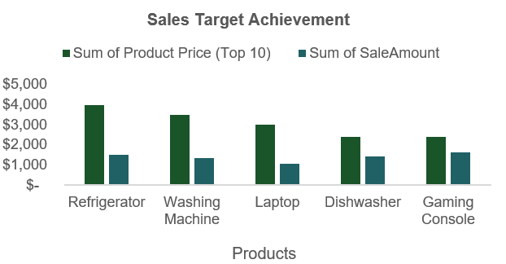
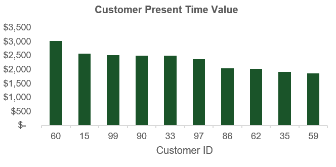
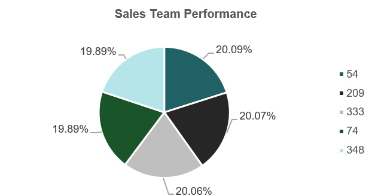
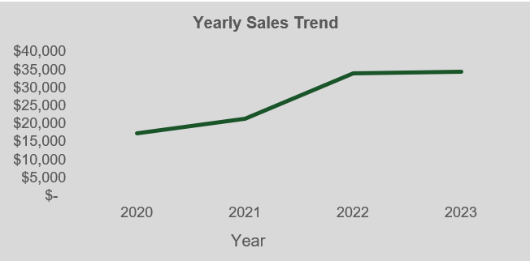
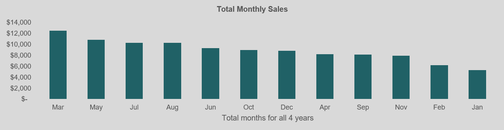
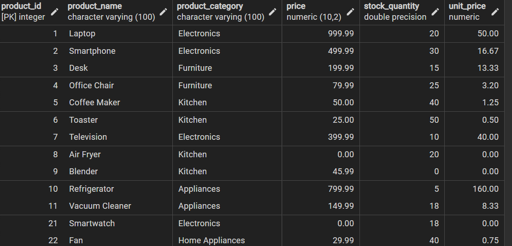
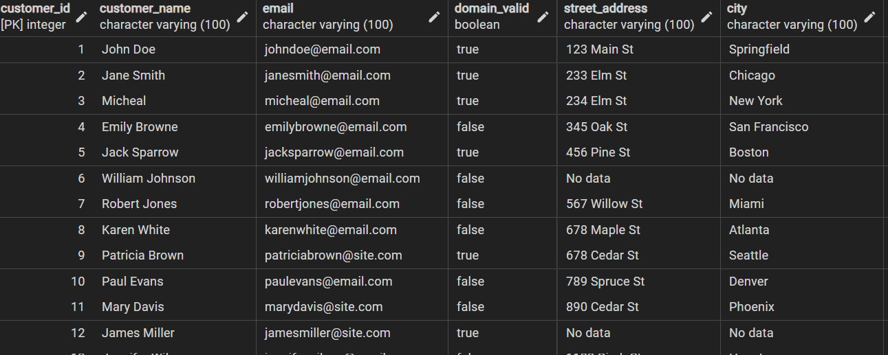
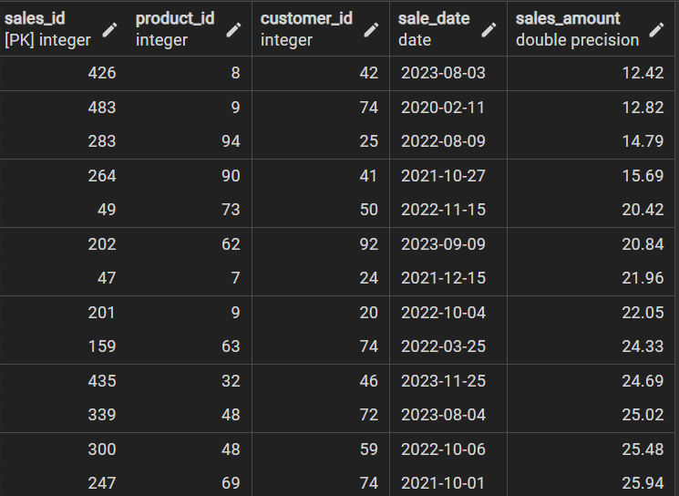

# Sales-Analysis - Customer LTV 

## Introduction:
In the fast-paced world of business, sales are the lifeblood of every organisation. But amidst the hustle and bustle of closing deals, it's easy to lose sight of the bigger picture. To unravel the hidden trends and patterns that drive sales success, I embarked on a deep dive into  Sive sales data.
Using SQL and Excel, I analysed key metrics such as customer present value(CPV), Yearly sales trend, Most profitable product etc to uncover valuable insights that can help Sive optimise their sales strategies and achieve even greater results.

This data comprises 3 distinct tables such as sales, customer and product table. 

## Skills/ concepts demonstrated:
The following capabilities that were incorporated-
- Data Manipulation
- TEXT to Columns
- Data Cleaning
- Vlookup
- Pivot Table Analysis
- Data Visualization
- Interactive Dashboard

### Excel
## EDA/Data Cleaning

I used text to split the data and united aper to make the customer’s data more uniform. I then used the IF statement to fill out each missing domain by nesting multiple If conditions. Afterwards, I called the apersend sign to join the customer's name and the new domain list created.

I replaced the blank data points in street address, city, state, and zip column with "No data". So it becomes easier to call forth customers with no information in these columns and it can be replaced when retrieved from the customer.

Several columns were identified as having incorrect data types. To ensure data integrity and adherence to data governance standards, the data types were standardised and corrected.

You can play around with the raw data [here](https://drive.google.com/drive/folders/1WzOf39aLm3jwkNEi1z_YC5JtMoSSEo11?usp=sharing)

## Insights
### Sales Target Achievement

Though average Sales showed  to be higher than the average price meaning that the business is selling more units than budgeted. However, for some specific goods, such as Refrigerator, Washing Machine, Laptop and Dishwasher and Gaming Console, the sales team is performing below target as these products are being sold completely below the price margin.

### Customer Present Value

The highest Customer Present Time Value(CPTM) is valued at $3,020 attributed to customer 60

### Sales Team Performance

In terms of highest sales generated, sales rep with the ID 54 brought in the highest revenue.

### Yearly Sales Trend

Sales trend was steadily progressive. This means that for over 4 years, the firm constantly experienced growth in its sales/revenue. Recording $17,339 in 2020, $21,465 in 2021, $34,074 in 2022, and $34,455 in 2023.

### Best Selling Months

Investigating further to monthly sales, It showed that in totality March brought in the highest revenue for all 4 years(2020, 2021, 2022, and 2023). However when investigated carefully, by comparing each month for each year, it was observed that March was not the month that brought in the highest revenue on its own as it fluctuates year in year out.

You can see full visual [here]

### SQL
## Loading the data into postgresql database
1. I started with creating a database in postgresql
2. After which i created tables for customer, product and sale
3. Then i used copy to bring in the data in sql “COPY "product_table" FROM 'C:\cizzy/product_table.csv' DELIMITER ',' CSV HEADER;”

Product Table                     |                   Customer Table
:--------------------------------:|:-----------------------------------:
                   |         

Sales Table
:--------------------------------:|
                   |

See code [here](https://github.com/rubytechme/Sales-Analysis---Customer-Lifetime-Value/blob/main/chizzy.sql)

## Other Insights
1. Highest revenue generating location
The highest revenue for the company came from CA California. This means that the business can establish more presence in CA )

2. Best Selling Product
The top-selling products were the electric heater and dog bed, generating over $1000 and $800 in revenue, respectively.

## Conclusion and Recommendation
- To optimise sales, the company should invest in expanding inventory for high-performing products.

- While current sales trends are positive, the company should explore additional sales-driving strategies, including the Pareto principle(80/20 rule) & email marketing building and nurturing their existing strong customer base email list to send targeted promotions, updates, and new products.

- To increase sales, the company should consider hiring more salespersons in regions with high sales potential, such as California. Also, by conducting a deeper analysis to identify the specific factors driving sales in California, the company can implement similar strategies in other locations to achieve similar growth.

